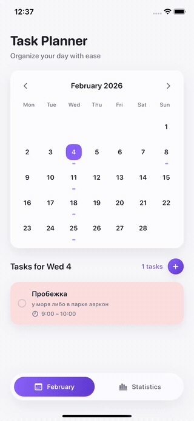
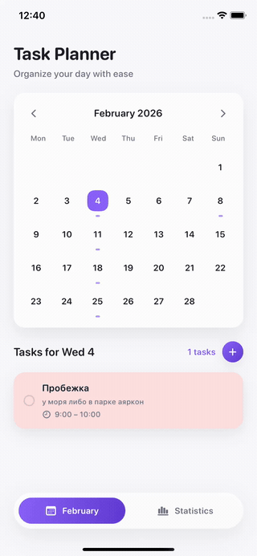
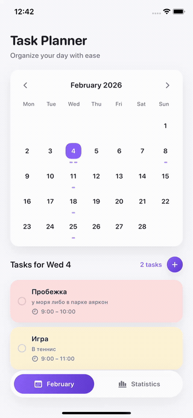

# TaskPlanner

TaskPlanner — это офлайн iOS-планировщик задач, реализованный на SwiftUI и Core Data.  
Приложение позволяет планировать задачи по календарю, работать с повторяющимися задачами и анализировать затраченное время с помощью статистики.

Проект выполнен как MVP и тестовое задание, с фокусом на рабочую логику и приятный интерфейс.

---

## 📱 Demo

### Planner & Statistics (переключение экранов)

### Create Task

### Edit & Delete Task

### Settings (начало недели с понедельника)

---

## ✨ Features

- Анимированный Splash Screen
- Календарь задач по месяцам
- Создание, редактирование и удаление задач
- Повторяющиеся задачи:
  - Daily
  - Weekly
  - Monthly
- Детали задачи:
  - отметка выполнено / не выполнено
  - удаление
- Статистика за месяц:
  - общее затраченное время
  - распределение по категориям
  - кастомный donut chart
- Настройки:
  - начало недели с понедельника
  - очистка всех данных
- Полностью офлайн (Core Data)

---

## 🧱 Architecture & Tech Stack

- **SwiftUI**
- **Core Data**
- **MVVM architecture**
- **Custom Design System**
- **iOS 15+**

---

## 🎨 Design

Интерфейс основан на Figma-дизайне и реализован с использованием собственного Design System:
- цвета
- отступы
- типографика
- карточки и тени

## 📝 Notes

Проект реализован за 4 часа и 30 минут как MVP.  
Основной фокус — на корректную бизнес-логику, удобный UX, без избыточных усложнений.
